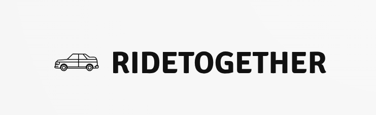

# RideTogether

**RideTogether** is a react based carpooling web application developed as an end-semester project for Spring 2025. Designed specifically for students of the National University of Sciences and Technology (NUST), it facilitates efficient and eco-friendly commuting by connecting drivers and passengers within the university community.



## 🚀 Features

- **User Authentication**: Secure sign-up and login functionalities.
- **Ride Posting**: Drivers can post available rides with details like destination, date, and time.
- **Ride Searching**: Passengers can search for available rides based on their preferences.
- **Responsive Design**: Ensures usability across various devices.
- **Help Center**: Provides assistance and FAQs for users.
- **Password Recovery**: Allows users to reset forgotten passwords.

## 🛠️ Technologies Used

- **React**: Structuring the web pages and implementing interactive functionality.
- **BootStrap & CSS3**: Styling the web pages.
- **Responsive Web Design**: Ensuring compatibility across devices.

## 👥 Team Members

- Muhammad Moiz
- Muhammad Haseeb ul Haq
- Abdul Ahad
- Obaid Satti
- Muhammad Omar Farooq

## Group Contributions

| Name                   | Qalam ID | Contributions                                                                                     |
| ---------------------- | -------- | ------------------------------------------------------------------------------------------------- |
| Muhammad Haseeb Ul Haq | 454512   | Designed the homepage UI, implemented Bootstrap components, and dark mode toggle                  |
| Muhammad Moiz          | 464192   | Worked on the help center layout, dynamic FAQs, and scroll-to-top feature                         |
| Muhammad Omar Farooq   | 461846   | Created the ride search page, implemented filtering logic in `SearchRide.jsx`                     |
| Obaid Satti            | 464870   | Handled login/signup pages styling and validation                                                 |
| Abdul Ahad             | 457564   | Developed the multi-step ride posting form, wrote `PostRide.js`, and created the `README.md` file |

## 📌 Getting Started

To view the application:

1. Clone the repository:

   ````bash
   git clone https://github.com/Muhammad-Moiz-Shafiq/RideTogether.git
   Navigate to the project directory:

   ```bash
       cd RideTogether
   ````

   install all required dependencies using command

```bash
    npm install
```

then run below command to start your website

```bash
    npm run dev
```

finally, go to the link provided in terminal

## Thank You!
